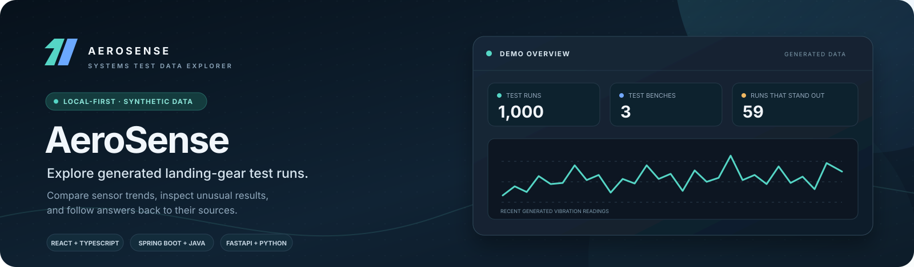
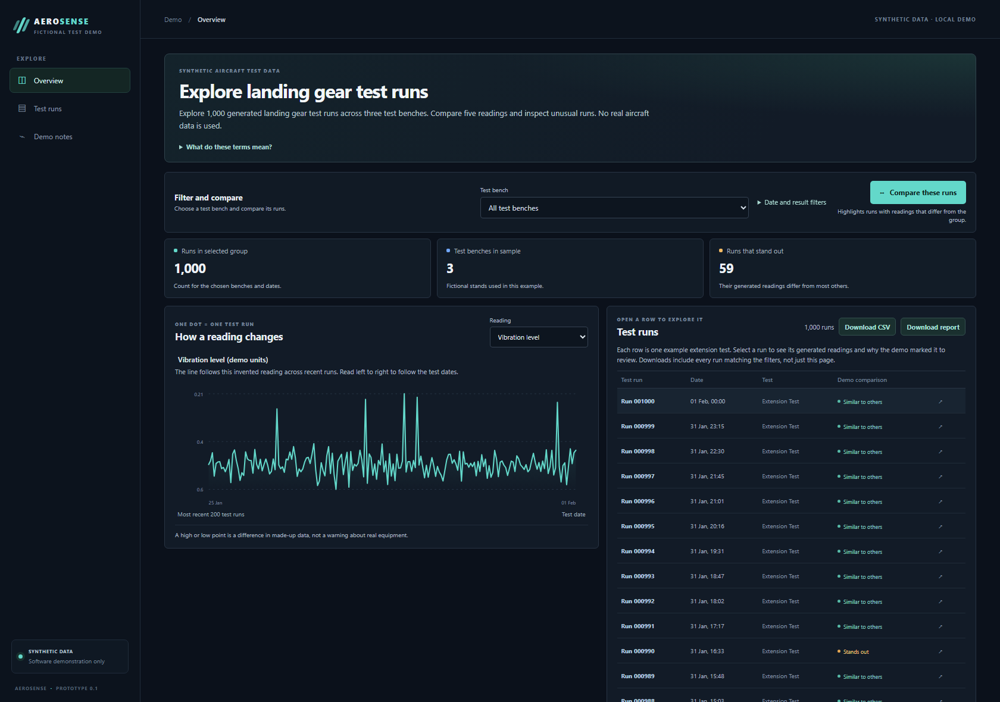
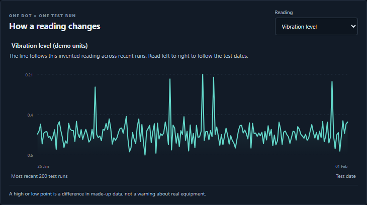
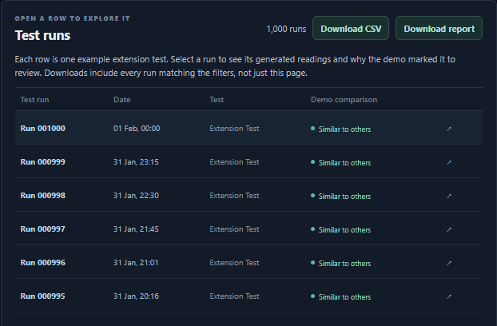
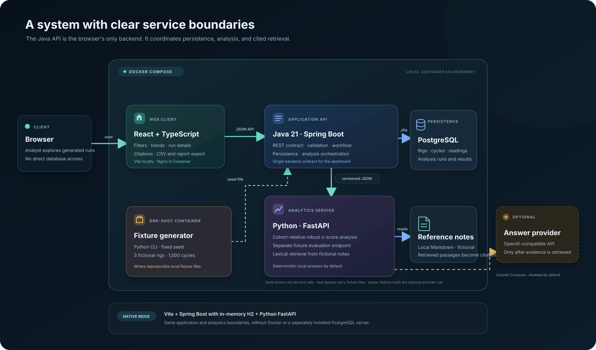
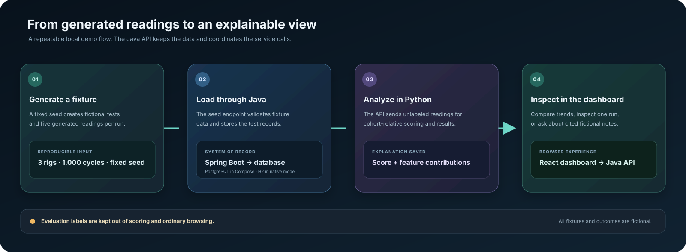

<div align="center">
  
  <p><strong>Explore generated landing-gear test runs, compare sensor readings, and inspect explainable results.</strong></p>
  <p>
    <a href="#run-locally">Run locally</a> ·
    <a href="#architecture">Architecture</a> ·
    <a href="docs/architecture.md">Design notes</a>
  </p>
</div>

**AeroSense** is a full-stack portfolio prototype for exploring 1,000 synthetic landing-gear extension tests across three fictional test benches. Filter and compare runs, follow sensor trends, inspect measurements behind unusual results, and ask questions answered with citations from fictional reference notes.

> [!CAUTION]
> This is a software demonstration using generated data. It contains no Airbus or operational aircraft data. Its scores, thresholds, notes, and explanations are not validated engineering limits, diagnoses, maintenance instructions, or safety advice.

## See it in action

The overview brings run counts, selected sensor trends, and the test-run list together. Open a row to inspect one generated run, its measurements, and any saved analysis result.

<p align="center">
  
</p>
<p align="center"><sub>Dashboard preview using the fixed-seed local demo dataset.</sub></p>

<div align="center">
  
  
</div>
<p align="center"><sub>Close-ups of the trend chart and run list from the same live dashboard capture.</sub></p>

### What you can do

| Explore | What it shows |
| --- | --- |
| **Compare test runs** | Filter by test bench, date, and generated comparison result. Download the matching runs as CSV or a short text report. |
| **Follow a measurement** | Plot a reading across recent runs and compare its values within the selected synthetic cohort. |
| **Inspect a run** | Open cycle details to see its five measurements and, after analysis, the stored score and numerical feature contributions. |
| **Ask with sources** | Search fictional notes and receive a concise answer with citations, or a clear insufficient-evidence response. |

## Architecture

The browser talks to one Java API. The API owns persistence and coordinates the Python analytics and retrieval service. Docker Compose supplies the PostgreSQL-backed container environment; a native development profile uses the same application boundary with an in-memory H2 database.

<p align="center">
  
</p>

### Services and boundaries

| Component | Responsibility | Interface |
| --- | --- | --- |
| **Dashboard** · React, TypeScript | Filters and displays test runs, trends, cycle details, reports, and cited answers. In Compose, Nginx serves the built frontend. | HTTP calls to the Java API only |
| **Application API** · Java 21, Spring Boot | Owns the public REST contract, request validation, workflow, database access, and persisted analysis runs. | JSON REST API for the browser; versioned JSON requests to Python |
| **Analytics and retrieval** · Python 3.12, FastAPI | Calculates cohort-relative robust z-scores, evaluates generated fixtures separately, and ranks paragraphs from local fictional notes. | Internal HTTP service called by Java |
| **Database** · PostgreSQL | Stores generated rigs, cycles, measurements, analysis runs, and results in the Compose environment. | Accessed by the Java API through JPA; schema managed with Flyway |
| **Fixture generator** · Python CLI | Produces a reproducible dataset from a fixed seed for local demonstration and evaluation. | JSON fixture files loaded through the Java seed workflow |

### Request and data flow

<p align="center">
  
</p>

The scoring request excludes ground-truth labels. Labels are available only to the separate evaluation path, so reported precision, recall, and F1 describe the generated fixtures and do not validate real equipment.

### Why these boundaries

- **Java owns the system of record.** It validates requests, coordinates workflows, and persists data so the browser has one stable API contract.
- **Python owns analysis and note retrieval.** Those functions are isolated behind JSON service contracts, which keeps the calculation and retrieval code independently understandable.
- **The assistant is local-first.** Lexical note retrieval and deterministic answer wording work without an API key. An optional OpenAI-compatible provider can phrase answers only after local retrieval finds evidence, with a deterministic fallback on provider errors.
- **The storage profile fits the run mode.** Compose runs PostgreSQL and Flyway migrations. The native demo uses in-memory H2 to avoid requiring Docker or a separately installed database, and its data resets when the Java process stops.
- **Containers package each runtime.** Three Dockerfiles build the frontend, Java API, and Python runtime used by both analytics and fixture generation. Compose starts them with PostgreSQL, health checks, and the shared fixture volume.

## Run locally

### Native preview without Docker

Install [mise](https://mise.jdx.dev/installing-mise.html) once. On Windows:

```powershell
winget install jdx.mise
```

Open a new terminal in the repository root, then run:

```powershell
mise run setup
mise run dev
```

Open **http://localhost:5173**, choose **Load synthetic demo data**, then choose **Run synthetic analysis**. The dashboard is available at port `5173`, the Java API at `8080`, and the Python service at `8000`.

The root [`mise.toml`](mise.toml) pins Java, Maven, Node.js, Python, and `uv`, and defines setup and run tasks. The local profile uses H2 in memory, so the demo does not need Docker or PostgreSQL. Data resets when the API stops, and this mode does not exercise PostgreSQL migrations. Stop the native services with **Ctrl+C**.

### Container environment with PostgreSQL

Prerequisite: Docker Desktop or another Docker Engine with Compose.

```powershell
docker compose up --build -d
```

Then open **http://localhost:5173** and load the demo data from the dashboard. Compose starts PostgreSQL, analytics, the fixture generator, the Java API, and the Nginx-served dashboard. The API applies the Flyway migration during startup.

```powershell
docker compose down
```

To also remove the local database and fixture volumes, run `docker compose down --volumes`. Compose defaults are for local development. To change ports or local credentials, copy `.env.example` to `.env`.

### Dependency manifests

Every runtime has a project manifest, and the package managers that support lockfiles have one checked in:

| Runtime | Dependency files |
| --- | --- |
| Tool versions and repeatable tasks | [`mise.toml`](mise.toml) |
| Java | [`backend/pom.xml`](backend/pom.xml), with Maven dependency versions |
| Python | [`analytics/pyproject.toml`](analytics/pyproject.toml) and [`analytics/uv.lock`](analytics/uv.lock) |
| Frontend | [`frontend/package.json`](frontend/package.json) and [`frontend/package-lock.json`](frontend/package-lock.json) |

Python dependencies are managed by `uv`, so a separate `requirements.txt` is not needed for the documented setup.

## Run the end-to-end demo flow

With the local services running, this PowerShell script seeds the generated data, runs analysis, browses cycle details, and requests an answer with citations:

```powershell
.\scripts\e2e-smoke.ps1
```

The same flow can run against the native H2 API or the Compose API. To check Compose configuration without starting containers, run `docker compose config --quiet`.

## Service endpoints

| Service | Local URL | Purpose |
| --- | --- | --- |
| Dashboard | [localhost:5173](http://localhost:5173) | Explore the demo |
| Java API | [localhost:8080/api/v1/health](http://localhost:8080/api/v1/health) | API health check and dashboard backend |
| Python health | [localhost:8000/health](http://localhost:8000/health) | Analytics service health |
| PostgreSQL | `localhost:5432` | Compose database |

See the [API examples](docs/api-examples.md) and [OpenAPI contract](docs/openapi.yaml) for requests and response schemas.

## Repository guide

```text
backend/       Java API, database entities, migrations, and Dockerfile
analytics/     Python analytics, note retrieval, fixture generator, and Dockerfile
frontend/      React dashboard and Nginx container configuration
data/          Synthetic fixture instructions and generated local files
docs/          Architecture, data dictionary, API, decisions, and deployment notes
scripts/       Local end-to-end smoke flow
docker-compose.yml PostgreSQL-backed multi-container environment
mise.toml      Pinned local toolchain and setup/run tasks
```

## Optional Google Cloud path

The repository includes a deployment guide for **Cloud Run**, **Artifact Registry**, and an existing **Cloud SQL for PostgreSQL** instance. It is a documented extension, not a deployment included with the project. The script does not create the Cloud SQL instance, which has a recurring charge. The demo services are public because this prototype has no authentication.

See the [Cloud Run deployment guide](docs/cloud-run.md) before deciding whether to deploy.

## Further reading

- [Architecture overview](docs/architecture.md)
- [Development guide](docs/development.md)
- [Service boundary decision](docs/adr/0001-service-boundaries.md)
- [Data dictionary](docs/data-dictionary.md)
- [Short demo script](docs/demo-script.md)
- [Optional Cloud Run guide](docs/cloud-run.md)
