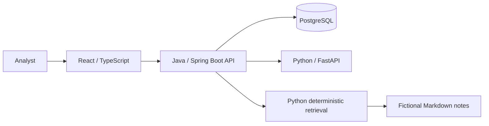

# Architecture

## System boundary

The React client calls only the Java API. Java owns public HTTP contracts, workflow, and persistence. Python accepts versioned JSON for scoring, evaluation, and retrieval, and does not own the relational database. The same Python service can host analytics and retrieval for this small local demo while keeping their modules separate. PostgreSQL stores generated cycles and persisted analysis results.

## Data and safety

All data and notes are generated or written as fictional demonstration material and labelled synthetic. Ground-truth anomaly labels exist only to evaluate the generator's injected patterns; they are not model inputs and are not returned in ordinary cycle browsing. A higher anomaly score means more unusual relative to this synthetic scoring cohort. Neither scores nor thresholds represent engineering limits.

## Request paths

- Browse: browser → Java API → PostgreSQL.
- Analyze: Java API → Python scoring → PostgreSQL; results include method, version, threshold, and feature contributions.
- Ask: browser → Java API → Python lexical retrieval; answers cite retrieved fictional note excerpts or state that the sources do not support an answer.

See [ADR 0001](adr/0001-service-boundaries.md) for the Java/Python boundary and [the data dictionary](data-dictionary.md) for wire contracts.
